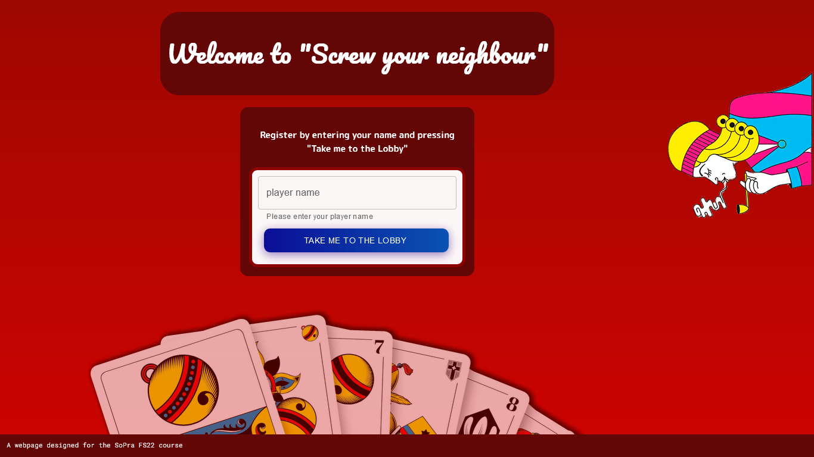
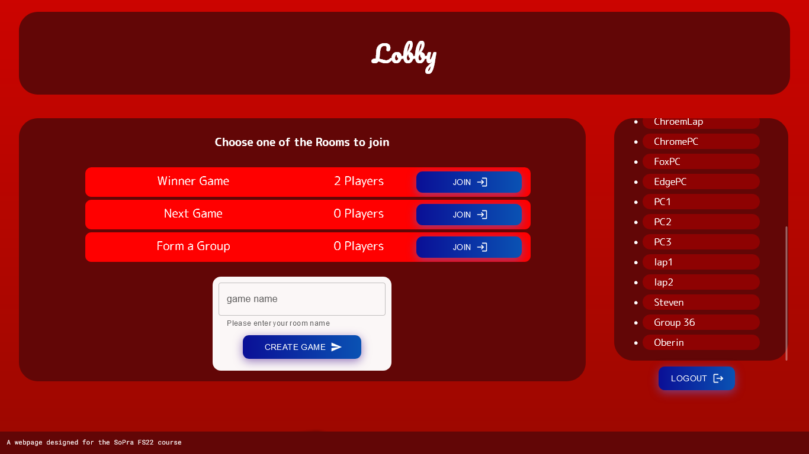
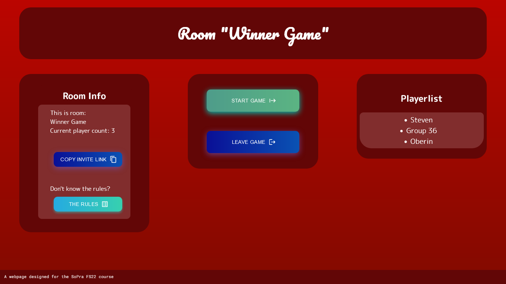
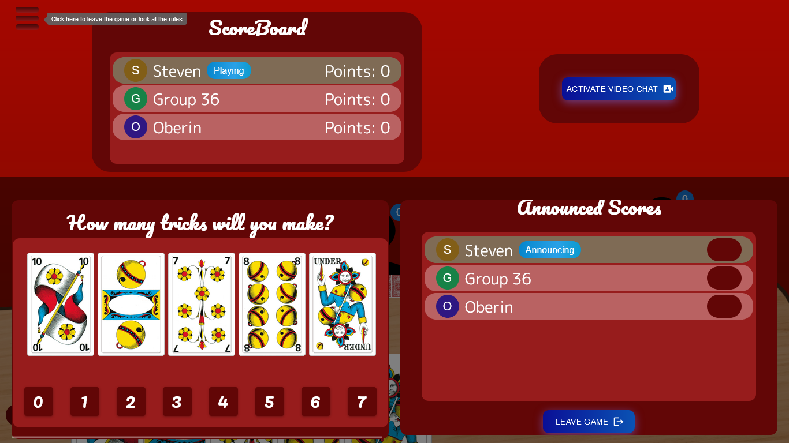
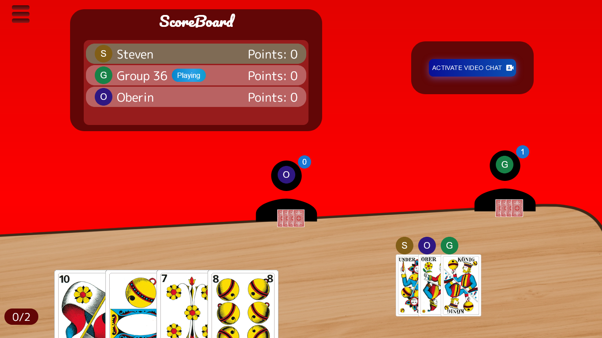
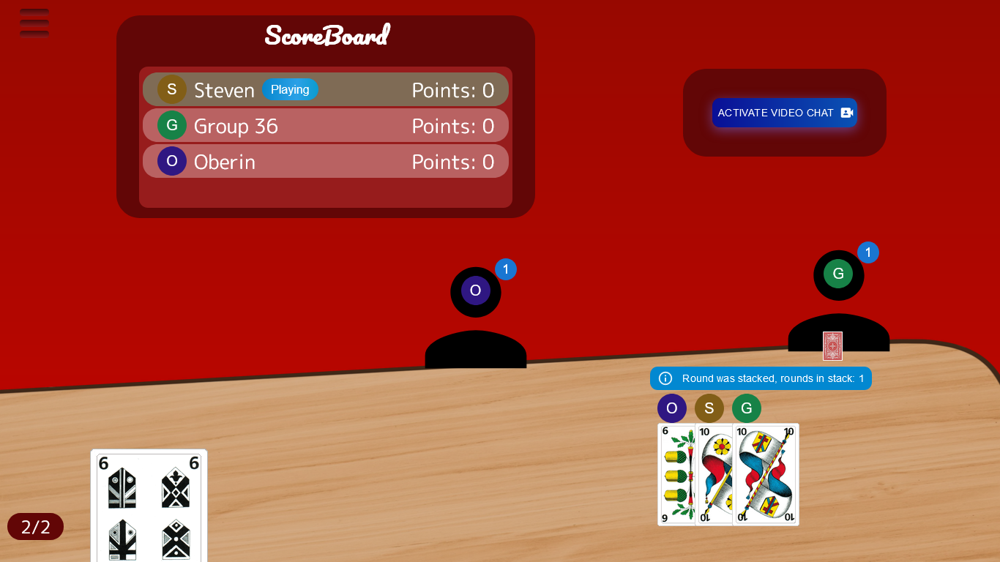
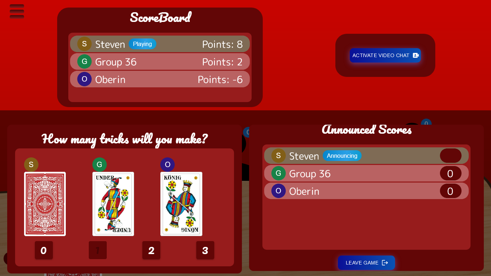
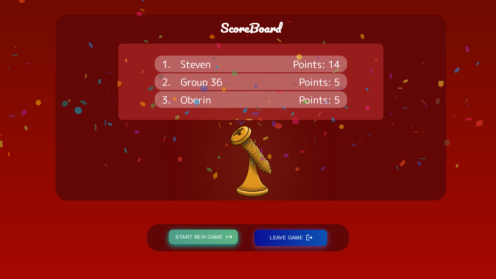
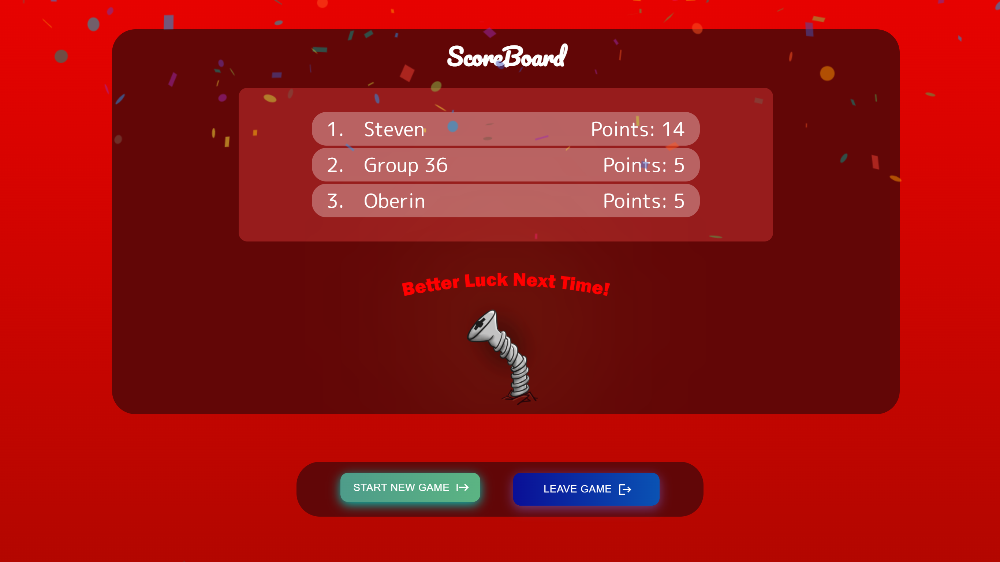

<h1 align="center">
   
</h1>

# Screw your neighbor: frontend solution [^1]

[^1]: By group 36 of the course "Software Praktikum"@UZH in FS 22.

## Github Badges:

[](https://github.com/sopra-fs22-group-36/screw-your-neighbor-react/actions/workflows/checks.yml)
[](https://github.com/sopra-fs22-group-36/screw-your-neighbor-react/actions/workflows/deploy-heroku.yml)

## SonarCloud Badges:

[](https://sonarcloud.io/summary/new_code?id=sopra-fs22-group-36_screw-your-neighbor-react)
[](https://sonarcloud.io/summary/new_code?id=sopra-fs22-group-36_screw-your-neighbor-react)
[](https://sonarcloud.io/summary/new_code?id=sopra-fs22-group-36_screw-your-neighbor-react)
[](https://sonarcloud.io/summary/new_code?id=sopra-fs22-group-36_screw-your-neighbor-react)

## Introduction
We are developing an online version of the world famous card game "Härdöpfle" also known as "Screw your neighbour" played with the 36 Swiss "Jasskarten". Main feature are
implemented as well as the stack rule and the special round with only one card. The game is made for two up to five players. 

## Technologies
These are the main technologies we used: 


React is a Java Script web framework. Components are hierarchically structured in React and can be represented in its syntax as self-defined JSX tags. With the concepts of unidirectional data flow and the Virtual DOM, the React model promises the simple yet high-performance structure of even 
complex applications. React, together with Typescript, forms the basis of our web application.


ESLint is a tool for static source code analysis. It identifies problematic spots and patterns in lines of JavaScript code. It is a linting tool where we could create our own rules and defined additional rules. It helped us in the sense that we could keep a consistent programming style as everyone contributed to the front end.


MobX is inspired by reactive programming principles as found in the spreadsheets. It is inspired by MVVM frameworks like MeteorJS tracker, knockout and Vue.js, but MobX brings Transparent Functional Reactive Programming to the next level and provides a standalone implementation. It implements TFRP in a glitch-free, synchronous, predictable and efficient manner. [^2]

[^2]: Source and more information on https://mobx.js.org/README.html


We chose TypeScript to type our methods, classes, and modules. It supports us in development and languages between the different modules in the frontend.


The design is based on material-like, map-like surfaces and the flat design style, which is known for its minimalism, but still uses a lot of animations and shadows to present objects as "materials" with behavior that corresponds to the laws of physics (e.g. a slight depth effect ) and let the user immediately see which areas contain important information or are interactive and what this interaction will achieve. [^3]

[^3]: Source and more information on https://material.io/


The node package manager is widely used and used as the default tool for the Node.js JavaScript runtime environment. We used the package manager to install packages into our application and to start, build and test. 


## High-level components

### Components

* [Views](src/components/views)  
Here are the different views of the application. Components only used in these views reside in the folder
of corresponding view.
* Requests to the Api  
The DOM and the classes to send requests to the api are generated with `openapi-typescript-codegen`.
How the DOM looks and what operations are possible is described in
[screw-your-neighbor-server-openapi.json](screw-your-neighbor-server-openapi.json).
The corresponding classes are generated into the src/generated folder. How they should be used is described in the
"State Management" chapter.

* State Management  
The state of the application is saved in the [stores](src/stores).
For more information, read the State Management Chapter.

### State Management

This app uses [MobX](https://github.com/mobxjs/mobx) as state management.  
The api is provided in [api.ts](src/api/api.ts), but then wrapped with the hook [useApi()](src/hooks/api/useApi.ts)
to provide global error handling and to display the [ApiErrorSnackBar](src/components/ui/ApiErrorSnackBar.tsx).  
The error message to show is stored in the [AppStore](src/stores/AppStore.ts) which also contains all other stores.  
The AppStore is provided via the [useContext()](https://reactjs.org/docs/hooks-reference.html#usecontext)
hook mechanism in [AppContext](src/AppContext.tsx).
The [PlayerStore](src/stores/PlayerStore.ts) stores your own player and the list of players in the lobby.

The stores and the api should not be used directly in the components,
but wrapped together with api calls in custom hooks like in [usePlayers()](src/hooks/api/usePlayers.ts).

If you want to use values from the store, don't forget to wrap your component in an observer(), like shown
in [Lobby](src/components/views/lobby/Lobby.tsx).

## Launch & Deployment

### Launch

This is just the frontend.
To get started, you also need the backend from [screw-your-neighbor-server](../screw-your-neighbor-server)
You find all scripts in [package.json](package.json).
To get started, run:  

```
npm ci
npm run openapi-generate
npm run start
```

If you are using windows, you may have to check some settings.
See the steps with the condition `runner.os == 'Windows'` in [checks.yml](.github/workflows/checks.yml).

Tests can be run with:

```
npm run test
```

### Deployment

This project has a heroku deployment setup. Required are the following repository secrets:
```yaml
      HEROKU_KEY: ${{ secrets.HEROKU_API_KEY }}
      HEROKU_EMAIL: ${{ secrets.HEROKU_EMAIL }}
      HEROKU_APP_NAME: ${{ secrets.HEROKU_APP_NAME }}
```
Then every merge on main with passing status checks gets deployed on the configured heroku (if available).

### Generate the classes of the api:

`npm run openapi-generate`

### Update the classes of the api:

Add the properties you need to  [screw-your-neighbor-server-openapi.json](screw-your-neighbor-server-openapi.json)

Then run again `npm run openapi-generate`

### Jitsi API
We implemented the Jitsi API into our game to give the players an option to video chat and 
to fulfill the requirements given to us by the SoPra Team.


## Illustrations
The illustrations have been taken with a resolution of 1366 x 768px on the target platform Google Chrome Version 99. We have limited ourselves to the essential views.

### Landing page


### Lobby & Room




### Game announcing round


### Game playing
There are main three different types of game rounds. This are the standard round, where the highest card win the round. Afterwards is a stacked round where two cards have the same rank and the next round will determine who has win both (or more) rounds. At the end there is the special round with only one card, where each player can't see his own card but all other ones. 

#### Standard round


#### Stacked round


#### One-card-round


### Winner :tada: / Looser :screwdriver::facepalm: page 
[^4]

[^4]

[^4]: Design by Carmen Kirchdorfer @CarmenUZH

## Roadmap
### Top features to implement
- Clear visualisation who's turn is right now
- Create your own avatar 
- Choose your own backside image for cards
- Change frontend to socket.io solution 
- Add soundeffects & potentially music

## Contributors
The "Screw your neighbor" application was developed in context of the SoPra (Software Praktikum / Software Engineerin Lab) module at the Institut für Informatik at the University of Zurich by Lucius Bachmann, Beat Furrer, Carmen Kirchdorfer, Moris Camporesi and Salome Wildermuth.

Any new contributors are welcome to contribute to our Screw-your-neighbor-family. Please don't hesitate to open a PR or an issue if there's something that needs improvement or if you want to help with implementing one of our roadmap features!


## License

This project is licensed under the **MIT license**.

See [LICENSE](LICENSE.txt) for more information.
