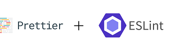

<h1 align="center">
   
</h1>

# Screw your neighbor: frontend solution[^1]

[^1]: By group 36 of the course "Software Praktikum"@UZH in FS 22.

## Github Badges:

## SonarCloud Badges:

## Introduction
World famous card game played with 36 Swiss "Jasskarten". 

## Technologies
Briefly overview about used main technologies: 

## Launch & Deployment
Small introduction to establish the frontend with react. After download use clean install.[^2]
[^2]: Project has an existing package-lock.json, all scripts are listed in package.json

`npm ci`

### Generate the classes of the api:

`npm run openapi-generate`

### Update the classes of the api:

Add the properties you need to  [screw-your-neighbor-server-openapi.json](screw-your-neighbor-server-openapi.json)

Then run again `npm run openapi-generate`

### Architecture

This app uses [MobX](https://github.com/mobxjs/mobx) as state management.  
The api is provided in [api.ts](src/api/api.ts), but then wrapped with the hook [useApi()](src/hooks/api/useApi.ts)
to provide global error handling and to display the [ApiErrorSnackBar](src/components/ui/ApiErrorSnackBar.tsx).  
The error message to show is stored in the [AppStore](src/stores/AppStore.ts) which contains also all other stores.  
The AppStore is provided via the [useContext()](https://reactjs.org/docs/hooks-reference.html#usecontext)
hook mechanism in [AppContext](src/AppContext.tsx).
The [PlayerStore](src/stores/PlayerStore.ts) stores your own player and the list of players in the lobby.

The stores (and the api) should not be used directly in the components,
but wrapped together with api calls in custom hooks like in [usePlayers()](src/hooks/api/usePlayers.ts).

If you want to show values from the store, don't forget to wrap your component in an observer(), like shown
in [Lobby](src/components/views/lobby/Lobby.tsx).

## Illustrations

### Lobby & Lobby

### Game announcing round

### Game playing

### Winner :tada: / Looser :screwdriver::facepalm: page 

## Roadmap

- Create your own avatar 
- Choose backside image for cards
- Change frontend to socket.io solution 

## Authors
- Carmen Kirchdorfer, full stack
- Salome Wildermuth, full stack
- Beat Furrer, full stack
- Lucius Simon Bachmann, full stack
- Moris Camporesi, full stack

## License

This project is licensed under the **MIT license**.

See [LICENSE](LICENSE.txt) for more information.
